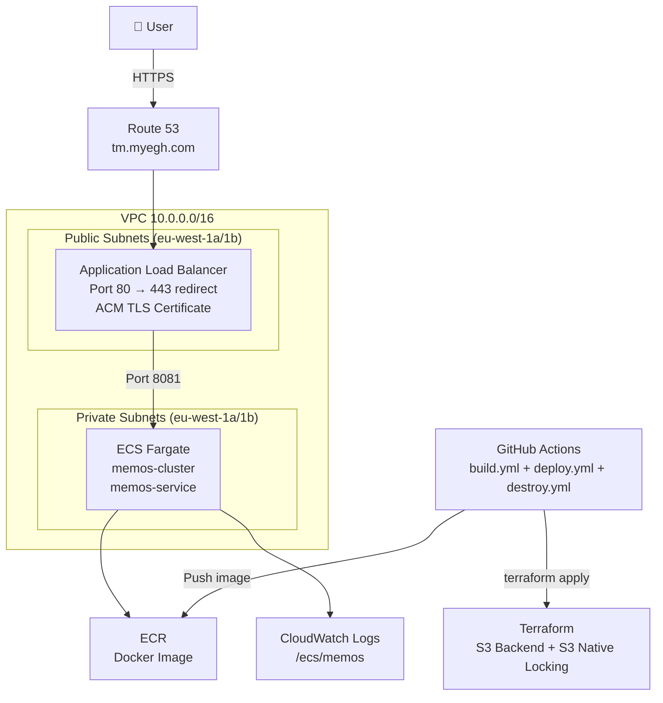

Here's your README in the exact same format you sent:

---

# Memos on AWS ECS Fargate

A self-hosted deployment of [Memos](https://github.com/usememos/memos) on AWS ECS Fargate, provisioned with Terraform and deployed via GitHub Actions CI/CD.

🌐 **Live URL:** https://tm.myegh.com

---

## Architecture


## Docker Image Optimisation

I compared single-stage and multi-stage builds of the same application source, targeting linux/amd64 and using the same Go compilation flags.

| Build type | Disk usage | Content size |
|---|---:|---:|
| Single-stage | 2.79 GB | 633 MB |
| Multi-stage | 75.8 MB | 19.7 MB |

The multi-stage image uses approximately 97.3% less disk space.

The single-stage image retains the compilers, source code and build dependencies. The multi-stage build separates frontend compilation, backend compilation and runtime packaging. Its final image contains the compiled application, embedded frontend assets and runtime dependencies.

Measurements were taken using `docker images memos`. Percentages are approximate because the displayed sizes are rounded. Node.js is supplied by different base distributions in the two builds.

To reproduce:

```
docker build --platform linux/amd64 -t memos:multi-stage .
docker build --platform linux/amd64 -f Dockerfile.single-stage -t memos:single-stage .
docker images memos
```

## Infrastructure Overview

| Component | Details |
|-----------|---------|
| Cloud | AWS eu-west-1 |
| Compute | ECS Fargate (256 CPU, 512MB RAM) |
| Container Registry | Amazon ECR |
| Load Balancer | Application Load Balancer |
| TLS | AWS Certificate Manager |
| DNS | Route 53 |
| State Backend | S3 with native locking |
| IaC | Terraform (modular) |
| CI/CD | GitHub Actions with OIDC |

### Terraform Modules
```
infra/
├── main.tf
├── variables.tf
├── outputs.tf
├── provider.tf
├── terraform.tfvars
└── modules/
    ├── vpc/        # VPC, subnets, IGW, NAT, route tables
    ├── ecs/        # Cluster, task definition, service
    ├── alb/        # ALB, target group, listeners
    ├── ecr/        # Container registry
    ├── acm/        # TLS certificate + Route53 validation
    ├── iam/        # Execution and task roles
    └── security/   # Security groups (separate ingress/egress resources)
```

### Bootstrap

One-time setup managed separately in `bootstrap/`:

```
bootstrap/
├── provider.tf   # AWS provider, no remote backend
├── state.tf      # S3 bucket for Terraform state
└── oidc.tf       # GitHub Actions OIDC provider + IAM role
```

Run once before anything else:
```
cd bootstrap
terraform init
terraform apply
```

---

## CI/CD Pipeline

Three separate GitHub Actions workflows:

### `build.yml` — Build and Push

* Triggers on push to `main` when app code or Dockerfile changes
* Authenticates to AWS via **OIDC** (no static keys)
* Builds Docker image and tags with Git SHA
* Pushes to ECR

### `deploy.yml` — Deploy and Verify

* Triggers automatically when `build.yml` completes successfully
* Runs `terraform fmt`, `validate`, `plan`, `apply`
* Waits 60s then hits `/healthz` — fails pipeline if unhealthy

### `destroy.yml` — Tear Down

* Manual trigger only (`workflow_dispatch`)
* Runs `terraform destroy` to remove all infrastructure
* Never triggered automatically — requires deliberate human action

### Required GitHub Secret
| Name | Description |
|------|-------------|
| `AWS_ROLE_ARN` | ARN of the IAM role with OIDC trust policy |

---

## Screenshots

### VPC


### Public Subnets


### Security Groups


### Certificate Issued


### DNS Resolution


### Pushed to ECR


### Load Balancer Working


### Docker Image Running


### Service Healthy in Cluster


### Website Live with HTTPS


---

## How to Reproduce

### Prerequisites

* AWS CLI configured with appropriate permissions
* Terraform >= 1.10.0
* Docker
* A registered domain in Route 53

### 1. Clone the repo

```
git clone https://github.com/EnamulRahman/memos-aws-infra.git
cd memos-aws-infra
```

### 2. Run bootstrap
Creates the S3 state bucket, OIDC provider, and GitHub Actions IAM role:
```
cd bootstrap
terraform init
terraform apply
```

### 3. Update variables
Edit `infra/terraform.tfvars` with your domain, region, and bucket name.

### 4. Deploy infrastructure

```
cd infra
terraform init
terraform apply
```

### 5. Add GitHub secret
Add `AWS_ROLE_ARN` to your GitHub repository secrets with the ARN of the IAM role created by bootstrap.

### 6. Push to main
Any push to `main` that touches app code or the Dockerfile triggers the full build and deploy pipeline automatically.

### 7. Tear down

```
cd infra
terraform destroy
```

---

## Key Design Decisions

* **Fargate over EC2** — no server management, scales to zero
* **Private subnets for ECS** — containers not directly internet accessible, traffic only via ALB
* **OIDC over static keys** — no long-lived AWS credentials stored in GitHub
* **Modular Terraform** — each layer isolated and independently manageable
* **Multi-stage Dockerfile** — separate frontend (Node/pnpm) and backend (Go) build stages, reducing image size by 97%
* **Non-root container** — app runs as a non-root user inside the container for security
* **Bootstrap separation** — ECR, S3 state bucket and OIDC setup live outside the main infra so they persist across destroy cycles
* **S3 native locking** — no DynamoDB table needed, uses S3's built-in lock mechanism
* **Path-filtered pipeline** — build only triggers on application code changes, not README edits
* **Security scanning** — tfsec/Checkov scans Terraform before apply to catch misconfigurations